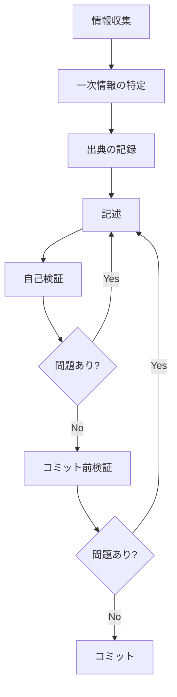

# ドキュメント作成ワークフロー

このガイドは、ドキュメントの品質を保証するための作業プロセスを定義します。

---

## 📋 作業フロー



---

## 1️⃣ 情報収集

### 一次情報の優先順位

上位が下位を上書きします。**下位のみを根拠に記述してはいけません**。

| 順位 | 情報源 | URL | 用途 |
|-----|-------|-----|------|
| 1 | **公式 changelog ページ**（HTML＋埋め込み JSON） | `https://kiro.dev/changelog/ide/<series>/` | リリース内容・**日付の正**・パッチ全量 |
| 2 | **公式ドキュメント（`.md` 版）** | `https://kiro.dev/docs/<path>.md` | 機能仕様・設定ファイル形式・リファレンス値 |
| 3 | **公式ドキュメント索引** | `https://kiro.dev/llms.txt` | ページ全量・**IDE / CLI / Web / Shared の区分判定** |
| 4 | **sitemap** | `https://kiro.dev/sitemap.xml` | ページ全量の機械検証（新規/削除ページ検知） |
| 5 | **Atom フィード** | `https://kiro.dev/changelog/feed.atom` | **新リリースの速報検知のみ**（網羅性がない） |
| 6 | **IDE 実機** | ローカル | 公式記述の曖昧さの解消 |
| 7 | 公式ブログ | `https://kiro.dev/blog/` | 背景・意図の補足 |
| — | GitHub Issues | `github.com/kirodotdev/Kiro` | **一次情報ではない**（掲載根拠にしない） |

### 情報収集の原則

- ✅ 公式情報を最優先
- ✅ 順位1・2で確認できない事項は「**未確認**」と明記する
- ✅ `.md` 版と HTML が矛盾したら **HTML を優先**し、差異を作業記録に残す
- ❌ 推測で記述しない
- ❌ **フィードのみを根拠に changelog を書かない**（パッチアンカー型エントリの title は系列タイトル固定で、変更内容を表しません）
- ❌ **Kiro CLI 版ドキュメントを IDE の一次情報として使わない**

---

## 2️⃣ 一次情報の特定

### バージョン情報

**新バージョンの検知は3情報源の和集合**で行います（フィード単独では取り落とします）。

```bash
# ① フィード（速報・低コスト）
curl -sS -o /tmp/kiro-ide-feed.atom https://kiro.dev/changelog/feed.atom
# IDE 判定は <category term="IDE"/> で行う（リンクパターンより堅牢）

# ② 系列ページの埋め込み JSON（網羅性の担保。末尾スラッシュ必須）
curl -sSL -A "Mozilla/5.0" -o /tmp/kiro-ide-1-0.html "https://kiro.dev/changelog/ide/1-0/"
python3 - <<'PY'
import re, json
s = open('/tmp/kiro-ide-1-0.html', encoding='utf-8').read().replace('\\"', '"')
m = re.search(r'"patches":(\[.*?\])', s)
for p in json.loads(m.group(1)):
    print(p['version'], p['date'])
PY

# ③ sitemap（新系列・新専用ページの検知）
curl -sS https://kiro.dev/sitemap.xml | grep -oE '<loc>[^<]*changelog/ide[^<]*</loc>'
```

### 機能仕様・設定情報

```bash
# 公式本文の Markdown 版を取得（docs のみ。changelog には存在しない）
curl -sSL -A "Mozilla/5.0" https://kiro.dev/docs/specs.md

# ページ全量と IDE / CLI / Web / Shared の区分を確認
curl -sSL -A "Mozilla/5.0" https://kiro.dev/llms.txt
```

### 記述粒度（changelog）

| 階層 | 対象 | 書き方 |
|-----|------|-------|
| **L1** | マイナー系列（1.0・0.12 等） | 機能別に詳細記述 |
| **L2** | ポイントリリース専用ページ | Improvements・Fixes を箇条書き |
| **L3** | パッチ（専用ページなし） | **版番号＋日付のみ**（公式に個別説明がないため説明を書かない） |

---

## 3️⃣ 出典の記録

### 方法1: インライン出典

```markdown
Kiro IDE の hooks は `.kiro/hooks/` 配下の JSON ファイルで定義します。

**出典**: [Hooks](https://kiro.dev/docs/hooks/)
```

### 方法2: 参照セクション

```markdown
## 参考情報

- [Kiro IDE 1.0.242](https://kiro.dev/changelog/ide/1-0-242/)
- [公式ドキュメント: Permissions](https://kiro.dev/docs/chat/permissions/)
```

### 方法3: 未確認事項の明示

```markdown
> **未確認**: 本設定の既定値は公式ドキュメントに記載がありません。
```

---

## 4️⃣ 記述

### 記述の原則

1. **正確性** — ✅ 一次情報に基づく／✅ 検証可能／❌ 推測しない
2. **明確性** — ✅ 具体的／✅ 曖昧さがない／❌ 「おそらく」等を使わない
3. **完全性** — ✅ 必要な情報を全て記載／✅ 出典を明記／❌ 情報を省略しない

### 禁止表現

- ❌ 「おそらく」「と思われる」「かもしれない」「だろう」「推測」「予想」

### 推奨表現

- ✅ 「〜です」（断定）／「〜と記載されています」（出典明記）／「〜を確認しました」（検証済み）／「〜によると」（出典引用）

### Kiro IDE / Kiro CLI の書き分け

Kiro IDE と Kiro CLI は `~/.kiro/` の一部を共有しますが、**同名機能でも仕様が異なる場合があります**。

- 各ページ冒頭に「本ページは **Kiro IDE 版**の仕様」を明記する
- 共通仕様の詳細を CLI 版へリンクする場合、**リンク先は `docs/cli/v3/`** を指す（IDE 1.0 の GA 機能に対応するのは CLI 3.0 系。非 v3 ページは 2.x 系の別仕様で、**特に hooks は完全な別物**）
- スラッシュコマンドのように**形式そのものが異なる機能は CLI 版へリンクしない**（「CLI 版とは形式が異なる」と明記する）

### 日付の表記

- **ISO 形式 `YYYY-MM-DD`**（公式表示 `Jul 28, 2026` → `2026-07-28`）
- タイムゾーン変換は行わない
- **取得日は本文に書かない**（作業記録に残す）

---

## 5️⃣ 自己検証

### 出典の確認

- [ ] 全ての技術的記述に出典がある
- [ ] 出典リンクが有効である
- [ ] 出典が一次情報（順位1〜4）である

### バージョン番号の確認

- [ ] 公式 changelog で確認済み
- [ ] リリース日が正確（公式ページ表示日を ISO 変換）
- [ ] パッチは埋め込み JSON で全量を確認済み

### 表現の確認

- [ ] 推測表現を使用していない
- [ ] 曖昧な表現を避けている
- [ ] 断定的な記述に根拠がある

### リンクの確認

- [ ] 内部リンクが有効（相対パス）
- [ ] 外部リンクが有効
- [ ] changelog リンクは末尾スラッシュ付き
- [ ] CLI 版へのリンクは `docs/cli/v3/`

---

## 6️⃣ コミット前検証

```bash
cd /home/katoh/projects/kiro-ide-docs

# 執筆中の常用
make check-kiro-ide-quick

# コミット前・公開前
make check-kiro-ide-all

# 公開範囲の機械確認（ローカル管理対象が除外されているか）
git check-ignore -q kiro-ide-docs/05_meta/x && echo "OK: 05_meta ignored"
git status --short
```

[コミット前チェックリスト](COMMIT_CHECKLIST.md)も確認してください。

---

## 7️⃣ コミット

```
<type>: <subject>

<body>

出典: <source>
```

### 例

```
docs: Kiro IDE 1.0.242対応（changelog・Agent Focus Mode）

- 1.0.242 の Improvements・Fixes を追加
- Code OSS v1.108.2 への移行を記載
- リリース日: 2026-07-28

出典: https://kiro.dev/changelog/ide/1-0-242/
```

---

## 🔄 問題発見時の対応

| 問題 | 対応 |
|------|------|
| **出典不明の記述** | 一次情報を特定 → 出典を追加。検証不可能なら削除 |
| **未確認のバージョン番号** | 公式 changelog（埋め込み JSON 含む）で確認 → 存在しなければ削除・修正 |
| **推測表現** | 一次情報で確認 → 確認できれば断定表現へ、できなければ「未確認」明示または削除 |
| **IDE / CLI の混同** | 公式 `llms.txt` の区分で確認 → IDE の一次情報で書き直す |
| **フィードに無いバージョンを発見** | 正常（フィードは網羅していない）。埋め込み JSON を正として採用する |

---

## 📊 品質指標

### 目標

- 出典不明の記述: **0件**
- 未確認のバージョン番号: **0件**
- 推測表現: **0件**
- リンク切れ: **0件**
- SSoT（正準値）の不一致: **0件**

### 測定方法

```bash
make check-kiro-ide-all
```

---

## 🔗 関連ドキュメント

- [コミット前チェックリスト](COMMIT_CHECKLIST.md)
- [サイト本体 README](../kiro-ide-docs/README.md)

---

**最終更新**: 2026-08-01
